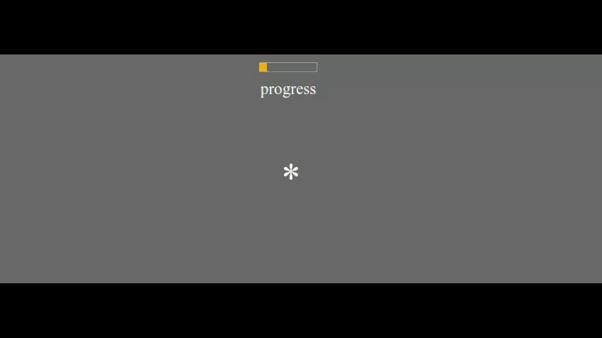

# Self-paced reading experiment with comprehension questions judgments for PCIbex

PCIbex version 2.0, Jan 29.2025

Programmed by Anna Pryslopska (pryslopska.com).
Please report bugs to: `anna.pryslopska [at] gmail.com`. This is an updated version of [this experiment](https://github.com/a-nap/spr_experiment).

## Description

The self-paced reading paradigm is a method used in psycholinguistics to study sentence processing. Participants read a sentence in word-by-word or phrase-by-phrase, pressing a button to reveal each segment. In this implementation, the sentence segments that were revealed, disappear as soon as the next segment is displayed. The sentence is followed by a screen which records the answers to a forced-choice comprehension question.
Two versions of the experiment are provided: Phrase-by-phrase and word-by-word presentation.

This code sets up an online psycholinguistic experiment using PCIbex, handling participant instructions, displaying reading materials, inserting comprehension questions with attention checks, and tracking accuracy.

[Read more here](https://pryslopska.com/experiments/spr.html) and [try the demo here](https://farm.pcibex.net/r/uHpQJa/).

## Contributing

Pull requests are welcome. For major changes, please open an issue first to discuss what you would like to change.

Please make sure to update tests as appropriate.

## License

Copyright (c) 2021 Anna Prysłopska pryslopska.com

Permission is hereby granted, free of charge, to any person obtaining a copy of this software and associated documentation files (the "Software"), to use, copy, modify, merge, publish, distribute, and sublicense copies of the Software, and to permit persons to whom the Software is furnished to do so.

The above copyright notice and this permission notice shall be included in all copies or substantial portions of the Software.

THE SOFTWARE IS PROVIDED "AS IS", WITHOUT WARRANTY OF ANY KIND, EXPRESS OR IMPLIED, INCLUDING BUT NOT LIMITED TO THE WARRANTIES OF MERCHANTABILITY, FITNESS FOR A PARTICULAR PURPOSE AND NONINFRINGEMENT. IN NO EVENT SHALL THE AUTHORS OR COPYRIGHT HOLDERS BE LIABLE FOR ANY CLAIM, DAMAGES OR OTHER LIABILITY, WHETHER IN AN ACTION OF CONTRACT, TORT OR OTHERWISE, ARISING FROM, OUT OF OR IN CONNECTION WITH THE SOFTWARE OR THE USE OR OTHER DEALINGS IN THE SOFTWARE.